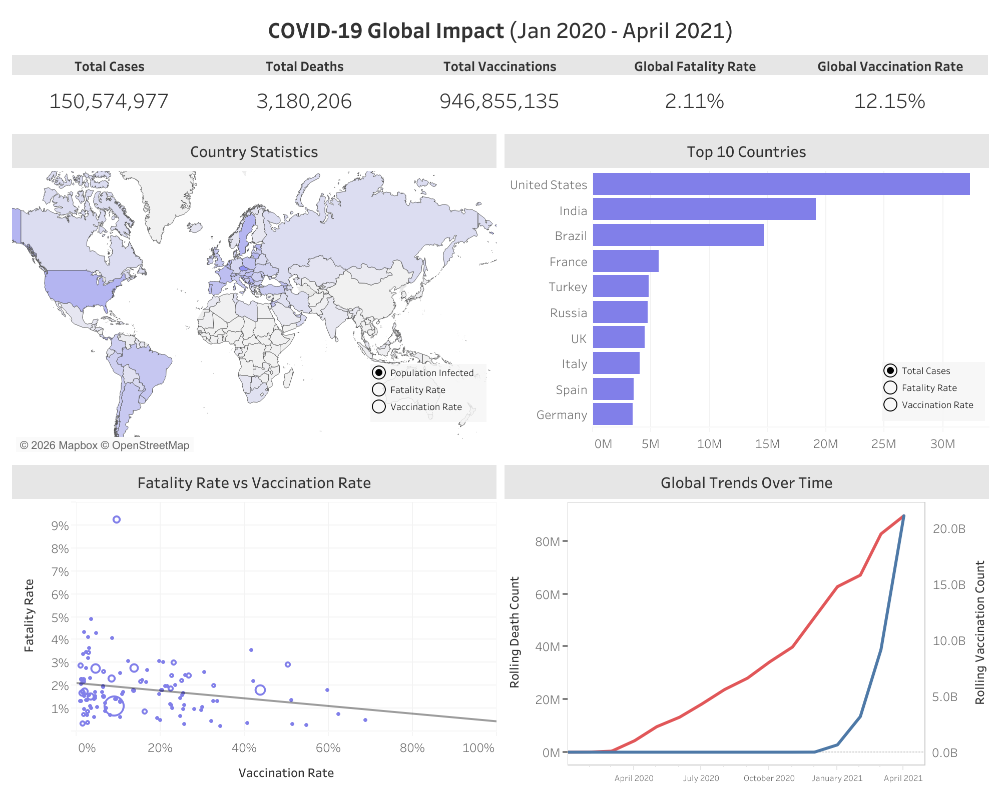

# COVID-19 Global Impact Analysis

## Project Overview
This project analyzes global COVID-19 trends from January 2020 to April 2021 using SQL and Tableau to examine infection rates, death rates, and vaccination progress globally and across countries.
The objective was to explore how vaccination rollout correlated with mortality trends and compare country-level impact.

## Key Questions Explored
* Which countries had the highest fatality and vaccination rates?
* What were the global metrics? How did these change over time?
* Is there a relationship between vaccinations and deaths?

## Tools
* SQL (BigQuery)
  * Data extraction, cleaning, and analysis
  * Aggregation
  * Joins
  * CTEs
  * Window functions (SUM OVER PARTITION BY)
* Tableau
  * Interactive dashboard creation
  * Parameter-based metric toggle

## Analysis and Key Insights
* Countries with higher vaccination rates generally showed lower fatality rates
* In the dataset's time period, rolling vaccination growth had an insigificant affect on death trends globally
* Significant disparities were observed between continents for percent population infected and vaccination rates

EDA queries can be found in covid_EDA_queries.sql
  
## Dashboard and Vizualization
I queried two separate tables to use for my Tableau visualizations, seen in covid_tableau_queries.sql.  

[Click here to view interactive dashboard!](https://public.tableau.com/views/COVID-19GlobalImpact_17724822203620/Dashboard1?:language=en-US&:sid=&:redirect=auth&:display_count=n&:origin=viz_share_link)

This dashboard contains five distinct visualizations:
  1. Global KPI Summary - Table containing Total Cases, Total Deaths, Total Vaccinations, Global Fatality Rate, and Global Vaccination Rate
  2. Country Statistics - World map shaded based on Country's selected metric (Percent Population Infected, Fatality Rate, Vaccination Rate)
  3. Top 10 Countries - Bar graph displaying the Top 10 Countries of a selected metric (Total Cases, Fatality Rate, Vaccination Rate)
  4. Fatality Rate vs Vaccination Rate - Scatterplot to show the relationship between Fatality Rate and Vaccination Rate of all countries
  5. Global Trends Over Time - Dual-axis line graph illustrating the Rolling Death Count and Vaccination Count over time

## Data Sources
Two data sets were used in this project, CovidDeaths.xlsx and CovidVaccinations.xlsx files. Both datasets are sourced from Our World In Data. 
